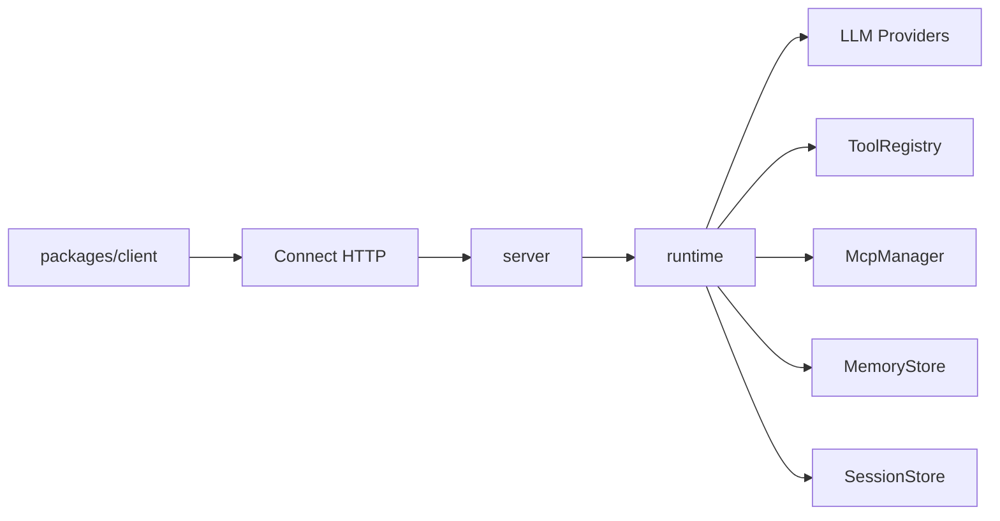

# Architecture

> Languages: [中文](../zh/architecture.md) | [English](./architecture.md)

## Shape

Mini-Agent uses a **single-core Runtime + thin client** design:

1. TypeScript `packages/runtime` implements the agent loop, tools, MCP, memory, and LLM providers.
2. `packages/server` exposes the same capabilities over Connect HTTP. The default listener is **HTTP/1.1**; the Connect adapter can codec Connect / gRPC / gRPC-Web (native gRPC usually still needs HTTP/2).
3. `@mini-agent/client` only handles transport and typing — it does not reimplement the loop.

## Agent loop

1. `run.started`
2. Optional `memory.hit` (retrieve history / long-term memory)
3. Assemble system + history, call the LLM
4. If there are tool_calls: may emit `message.delta` first, then `tool.started` → (optional `tool.approval_required` / `tool.result_delta` / `subagent.*`) → `tool.completed`, write results back, continue
5. If there are no tool_calls: `message.delta` + `run.completed`
6. On error or cancel: `run.error`

Connect stream events use camelCase `payload.case` (e.g. `textDelta`, `toolCall`, `toolApprovalRequired`, `toolResultDelta`, `subagentStarted`); the list above uses runtime dotted names.

## Protocol

Single contract: `proto/agent/v1/agent.proto`

- `CreateSession` / `GetSession`
- `RunAgent` (server streaming events)
- `CancelRun`
- `ResolveToolApproval`
- `ListTools`
- `RegisterHttpTool`
- `UpsertMcpServer`
- `UpsertCronJob` / `GetCronJob` / `ListCronJobs` / `DeleteCronJob` / `SetCronJobEnabled`
- `CompactSession`

Generate: `pnpm generate` → `packages/shared/src/gen`

## Cron Scheduler

In-process scheduler on the server: fires cron expressions by calling `agent.run` directly (no loopback HTTP).

- Storage: `MINI_AGENT_DATA_DIR/cron.sqlite`
- Config file: loads repo-root `cron.jobs.yaml` by default (or `MINI_AGENT_CRON_FILE`); `source=file` jobs sync on startup; `source=api` jobs are not deleted by file sync
- Dynamic management: Cron RPCs above; observe via `last_*` / `next_run_at_ms`
- Unattended approvals: per-job `auto_approve`, or global `MINI_AGENT_AUTO_APPROVE`
- Overlap: default `skip` (skip if previous run still in progress)

## Memory layers

Aligned with [s09 Memory](https://learn.shareai.run/zh/s09/) / CC memdir: compaction drops detail, so durable facts live in Markdown files across compact and sessions.

| Layer | Responsibility | Default |
|-------|----------------|---------|
| Working / Session | Multi-turn messages | Server default SQLite (`node:sqlite`, `MINI_AGENT_DATA_DIR`); in-memory also available |
| Durable File Memory | Cross-session durable memory | `workspace/.mini-agent/memory/` (`MEMORY.md` index + per-entry `.md`); override with `CreateAgentOptions.memory.root` or `MINI_AGENT_MEMORY_DIR` |
| Context Compact | Context compression | Four-layer pipeline (budget → snip → micro → LLM); **memory files are not compacted** |

### Durable File Memory behavior

- **Index injection**: each `run` feeds `MEMORY.md` through the system-prompt assembler as an on-demand memory section (does not mutate `session.systemPrompt`)
- **Relevant bodies**: LLM side-query selects up to 5 files (keyword fallback on name+description), prefixed onto the user turn; emits `memory.hit`
- **Auto extract**: when a run ends with no tool_calls, an LLM extract writes new files; failures are logged only
- **Consolidate**: when file count ≥ threshold (default 10), LLM dedupes/merges (teaching-scale gate; no CC four-layer Dream)
- **Tools**: `memory_write` / `memory_read` (`risk=read`, disk writes skip approval)
- **Escape hatch**: `memory.store` injects a custom `MemoryStore` (skips file memory); bag-of-words `InMemoryMemoryStore` remains for tests

Non-goals: embeddings, team memory / multi-host locks, forked agents.

## System Prompt

Aligned with [s10 System Prompt](https://learn.shareai.run/zh/s10/): assembled at runtime from real state, not one hardcoded blob.

| Section | Strategy | Content |
|---------|----------|---------|
| identity | always | Default identity; non-empty `createAgent.systemPrompt` / `session.systemPrompt` overrides this section only |
| tools | always | Registered tool names (full schemas still via API `tools[]`) |
| workspace | always | `workspaceRoot` |
| memory | on demand | Appended when `MEMORY.md` index is non-empty |

Within a run, `SystemPromptCache` reuses the assembled string when context is unchanged (string-join cache only — not API prompt cache). Relevant memory bodies still inject as a per-turn user prefix, not into system.

Simplifications vs CC: no Skills / multi-style section packs / `SYSTEM_PROMPT_DYNAMIC_BOUNDARY`.

## Context Compact

Aligned with [s08](https://learn.shareai.run/zh/s08/) ("cheap first, expensive later"):

1. **L3 tool_result_budget**: persist oversized tool results under `workspace/.mini-agent/tool-results/`
2. **L1 snip_compact**: snip middle messages when over the message cap (keeps tool_use / tool_result pairs intact)
3. **L2 micro_compact**: placeholder older tool results; keep the most recent N intact
4. **L4 compact_history**: LLM summary when estimated tokens exceed the threshold; transcripts under `.mini-agent/transcripts/`
5. **reactive**: one more compact if the API reports context overflow (keeps a short tail)

Triggers: automatic in-run, `CompactSession` RPC, and the builtin `compact` tool.

## Embedding vs network

- Same-process: call `createAgent()` / `createMiniAgentServer({ agent })` directly
- Cross-process: HTTP Connect client (`@mini-agent/client`)

## Auth & limits

- Header: `x-api-key` or `Authorization: Bearer <key>`
- Auth is skipped when `MINI_AGENT_API_KEY` is unset
- In-memory sliding-window rate limit (default 60s / 120 req / key)
