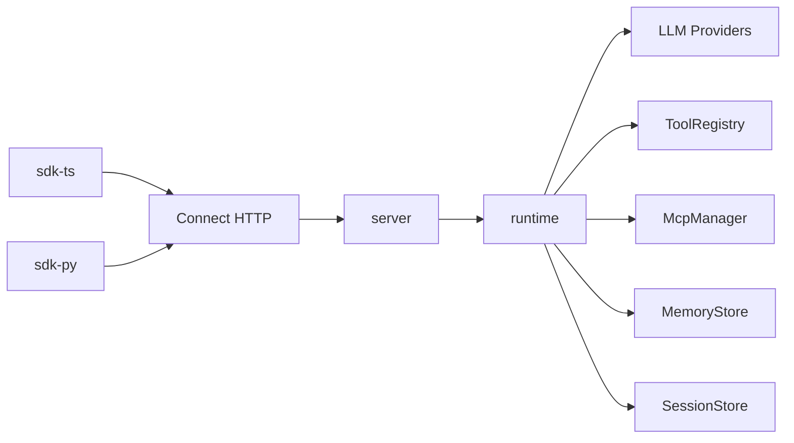

# Architecture

> Languages: [中文](../zh/architecture.md) | [English](./architecture.md)

## Shape

Mini-Agent uses a **single-core Runtime + thin clients** design:

1. TypeScript `packages/runtime` implements the agent loop, tools, MCP, memory, and LLM providers.
2. `packages/server` exposes the same capabilities over Connect HTTP, with gRPC enabled by default.
3. The TS / Python SDKs only handle transport and typing — they do not reimplement the loop.

## Agent loop

1. `run.started`
2. Optional `memory.hit` (retrieve history / long-term memory)
3. Assemble system + history, call the LLM
4. If there are tool_calls: `tool.started` → execute → `tool.completed`, write results back, continue
5. Otherwise `message.delta` + `run.completed`
6. On error or cancel: `run.error`

## Protocol

Single contract: `proto/agent/v1/agent.proto`

- `CreateSession` / `GetSession`
- `RunAgent` (server streaming events)
- `CancelRun`
- `ListTools`
- `RegisterHttpTool`
- `UpsertMcpServer`

Generate: `pnpm generate` → `packages/shared/src/gen`

## Memory layers

| Layer | Responsibility | Default |
|-------|----------------|---------|
| Working / Session | Multi-turn messages | SQLite (`node:sqlite`) or in-memory |
| Long-term | Cross-session retrieval | In-memory vectors (bag-of-words similarity) |
| Summary | Compress long history | Truncation + system summary |

## Embedding vs network

- Same-process TypeScript: call `createAgent()` / `createMiniAgentServer({ agent })` directly
- Cross-language / cross-process: HTTP Connect clients

## Auth & limits

- Header: `x-api-key` or `Authorization: Bearer <key>`
- In-memory sliding-window rate limit (default 60s / 120 req / key)
