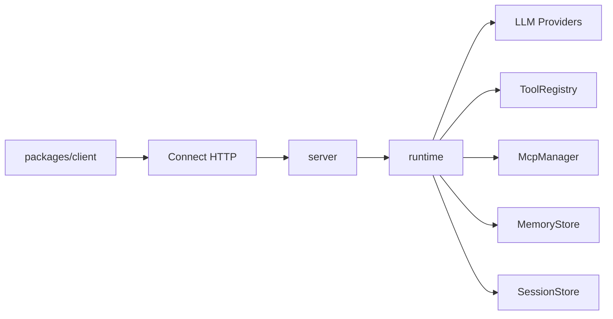

# Architecture

> Languages: [中文](../zh/architecture.md) | [English](./architecture.md)

## Shape

Mini-Agent uses a **single-core Runtime + thin client** design:

1. TypeScript `packages/runtime` implements the agent loop, tools, MCP, memory, and LLM providers.
2. `packages/server` exposes the same capabilities over Connect HTTP. The default listener is **HTTP/1.1**; the Connect adapter can codec Connect / gRPC / gRPC-Web (native gRPC usually still needs HTTP/2).
3. `@mini-agent/client` only handles transport and typing — it does not reimplement the loop.

## Agent loop

1. `run.started`
2. Optional `memory.hit` (retrieve history / long-term memory)
3. Assemble system + history, call the LLM
4. If there are tool_calls: may emit `message.delta` first, then `tool.started` → (optional `tool.approval_required` / `tool.result_delta` / `subagent.*`) → `tool.completed`, write results back, continue
5. If there are no tool_calls: `message.delta` + `run.completed`
6. On error or cancel: `run.error`

Connect stream events use camelCase `payload.case` (e.g. `textDelta`, `toolCall`, `toolApprovalRequired`, `toolResultDelta`, `subagentStarted`); the list above uses runtime dotted names.

## Protocol

Single contract: `proto/agent/v1/agent.proto`

- `CreateSession` / `GetSession`
- `RunAgent` (server streaming events)
- `CancelRun`
- `ResolveToolApproval`
- `ListTools`
- `RegisterHttpTool`
- `UpsertMcpServer`
- `UpsertCronJob` / `GetCronJob` / `ListCronJobs` / `DeleteCronJob` / `SetCronJobEnabled`

Generate: `pnpm generate` → `packages/shared/src/gen`

## Cron Scheduler

In-process scheduler on the server: fires cron expressions by calling `agent.run` directly (no loopback HTTP).

- Storage: `MINI_AGENT_DATA_DIR/cron.sqlite`
- Config file: loads repo-root `cron.jobs.yaml` by default (or `MINI_AGENT_CRON_FILE`); `source=file` jobs sync on startup; `source=api` jobs are not deleted by file sync
- Dynamic management: Cron RPCs above; observe via `last_*` / `next_run_at_ms`
- Unattended approvals: per-job `auto_approve`, or global `MINI_AGENT_AUTO_APPROVE`
- Overlap: default `skip` (skip if previous run still in progress)

## Memory layers

| Layer | Responsibility | Default |
|-------|----------------|---------|
| Working / Session | Multi-turn messages | Server default SQLite (`node:sqlite`, `MINI_AGENT_DATA_DIR`); in-memory also available |
| Long-term | Cross-session retrieval | In-memory bag-of-words token overlap (not embeddings / a vector DB) |
| Summary | Compress long history | Truncation + system summary |

## Embedding vs network

- Same-process: call `createAgent()` / `createMiniAgentServer({ agent })` directly
- Cross-process: HTTP Connect client (`@mini-agent/client`)

## Auth & limits

- Header: `x-api-key` or `Authorization: Bearer <key>`
- Auth is skipped when `MINI_AGENT_API_KEY` is unset
- In-memory sliding-window rate limit (default 60s / 120 req / key)
