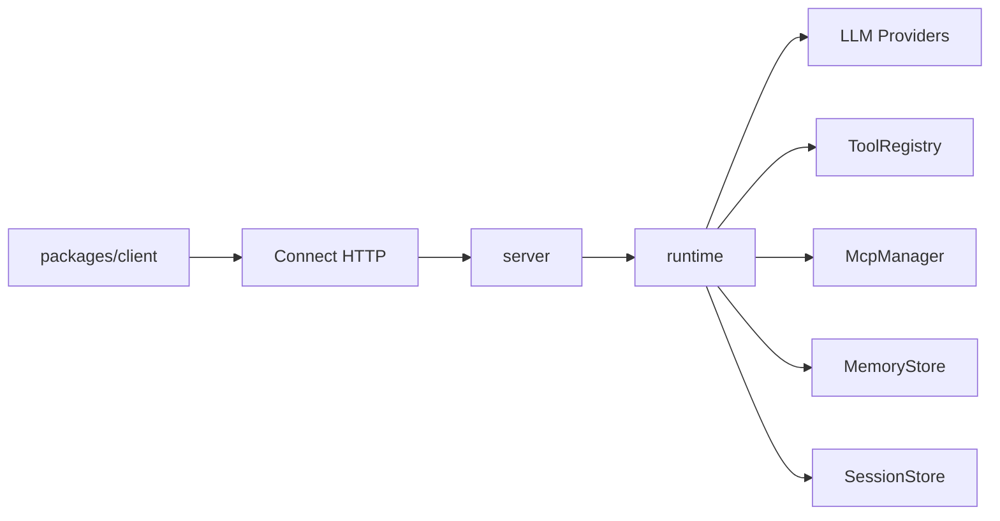

# 架构

> 语言：[中文](./architecture.md) | [English](../en/architecture.md)

## 整体形态

Mini-Agent 采用 **单核心 Runtime + 薄客户端**：

1. TypeScript `packages/runtime` 实现 agent loop、工具、MCP、memory、LLM providers。
2. `packages/server` 用 Connect over HTTP 暴露同一能力。默认以 **HTTP/1.1** 监听；Connect 适配器可编解码 Connect / gRPC / gRPC-Web（原生 gRPC 通常还需自行换 HTTP/2）。
3. `@mini-agent/client` 只做传输与类型封装，不复制 loop 逻辑。

## Agent loop

1. `run.started`
2. 可选 `memory.hit`（检索历史 / 长期记忆）
3. 组装 system + history，调用 LLM
4. 若有 tool_calls：可能先发 `message.delta`，再 `tool.started` →（可选 `tool.approval_required` / `tool.result_delta` / `subagent.*`）→ `tool.completed`，写回消息后继续
5. 若无 tool_calls：`message.delta` + `run.completed`
6. 异常或取消：`run.error`

对外 Connect 流事件使用 camelCase `payload.case`（如 `textDelta`、`toolCall`、`toolApprovalRequired`、`toolResultDelta`、`subagentStarted`）；上表为 runtime 内部点分命名。

## 协议

唯一契约：`proto/agent/v1/agent.proto`

- `CreateSession` / `GetSession`
- `RunAgent`（server streaming events）
- `CancelRun`
- `ResolveToolApproval`
- `ListTools`
- `RegisterHttpTool`
- `UpsertMcpServer`
- `UpsertCronJob` / `GetCronJob` / `ListCronJobs` / `DeleteCronJob` / `SetCronJobEnabled`
- `CompactSession`

生成：`pnpm generate` → `packages/shared/src/gen`

## Cron Scheduler

服务端进程内调度：按 cron 表达式直接调用 `agent.run`（不经假 HTTP）。

- 持久化：`MINI_AGENT_DATA_DIR/cron.sqlite`
- 配置文件：默认加载仓库根 `cron.jobs.yaml`（或 `MINI_AGENT_CRON_FILE`）；`source=file` 的任务在启动时与文件同步，`source=api` 不受文件删除影响
- 动态管理：上述 Cron RPC；观测字段 `last_*` / `next_run_at_ms`
- 无头审批：job 级 `auto_approve`，或全局 `MINI_AGENT_AUTO_APPROVE`
- 重叠策略：默认 `skip`（上一次未结束则跳过）

## Memory 分层

对齐 [s09 Memory](https://learn.shareai.run/zh/s09/) / CC memdir 思路：压缩会丢细节，跨 compact / 跨 session 的事实落在 Markdown 文件里。

| 层级 | 职责 | 默认实现 |
|------|------|----------|
| Working / Session | 多轮消息 | 服务端默认 SQLite（`node:sqlite`，`MINI_AGENT_DATA_DIR`）；亦可内存 |
| Durable File Memory | 跨会话持久记忆 | `workspace/.mini-agent/memory/`（`MEMORY.md` 索引 + 单条 `.md`）；可用 `CreateAgentOptions.memory.root` 或 `MINI_AGENT_MEMORY_DIR` 覆盖 |
| Context Compact | 上下文压缩 | 四层管线（budget → snip → micro → LLM）；**记忆文件不参与 compact** |

### Durable File Memory 行为

- **索引注入**：每次 `run` 将 `MEMORY.md` 经 System Prompt 组装器按需拼进 memory section（不写回 `session.systemPrompt`）
- **相关正文**：LLM side-query 最多选 5 个文件（失败则关键词匹配 name+description），作为本轮 user 前缀；发 `memory.hit`
- **自动提取**：run 以无 tool_calls 正常结束时 LLM 提取新记忆写盘；失败只打日志
- **整理**：记忆文件数 ≥ 阈值（默认 10）时 LLM 去重合并（教学版门控，无 CC 四层 Dream）
- **工具**：`memory_write` / `memory_read`（`risk=read`，写盘免审批）
- **逃生舱**：`memory.store` 可注入自定义 `MemoryStore`（跳过文件记忆）；旧词袋 `InMemoryMemoryStore` 仍保留供测试

简化点：无 embedding、无 Team memory / 多机锁、无 forked agent。

## System Prompt

对齐 [s10 System Prompt](https://learn.shareai.run/zh/s10/)：运行时按真实状态组装，不写死一整段。

| Section | 策略 | 内容 |
|---------|------|------|
| identity | 始终 | 默认身份文案；`createAgent.systemPrompt` / `session.systemPrompt` 非空时只覆盖本段 |
| tools | 始终 | 当前注册工具名列表（完整 schema 仍走 API `tools[]`） |
| workspace | 始终 | `workspaceRoot` |
| memory | 按需 | `MEMORY.md` 索引非空时追加 |

同一次 run 内 context 未变时，`SystemPromptCache` 复用已组装字符串（仅避免重复拼接，不是 API prompt cache）。相关记忆正文仍作为本轮 user 前缀注入，不进 system。

相对 CC 的简化：无 Skills / 多 section 风格包 / `SYSTEM_PROMPT_DYNAMIC_BOUNDARY`。

## Context Compact

对齐 [s08](https://learn.shareai.run/zh/s08/)「便宜先跑、贵的后跑」：

1. **L3 tool_result_budget**：过大 tool 结果落盘到 `workspace/.mini-agent/tool-results/`
2. **L1 snip_compact**：消息数超限时裁中间（保护 tool_use / tool_result 成对）
3. **L2 micro_compact**：旧 tool 结果占位，保留最近 N 条完整内容
4. **L4 compact_history**：估算 token 超阈值时 LLM 摘要；transcript 写入 `.mini-agent/transcripts/`
5. **reactive**：API 报 context 过长时再压一次（保留短尾）

触发方式：run 内自动、`CompactSession` RPC、内置工具 `compact`。

## 嵌入 vs 网络

- 同进程：直接 `createAgent()` / `createMiniAgentServer({ agent })`
- 跨进程：HTTP Connect 客户端（`@mini-agent/client`）

## 鉴权与限流

- Header：`x-api-key` 或 `Authorization: Bearer <key>`
- 未配置 `MINI_AGENT_API_KEY` 时不鉴权
- 内存滑动窗口限流（默认 60s / 120 req / key）
