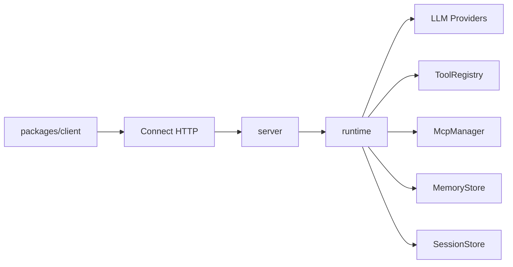

# 架构

> 语言：[中文](./architecture.md) | [English](../en/architecture.md)

## 整体形态

Mini-Agent 采用 **单核心 Runtime + 薄客户端**：

1. TypeScript `packages/runtime` 实现 agent loop、工具、MCP、memory、LLM providers。
2. `packages/server` 用 Connect over HTTP 暴露同一能力。默认以 **HTTP/1.1** 监听；Connect 适配器可编解码 Connect / gRPC / gRPC-Web（原生 gRPC 通常还需自行换 HTTP/2）。
3. `@mini-agent/client` 只做传输与类型封装，不复制 loop 逻辑。

## Agent loop

1. `run.started`
2. 可选 `memory.hit`（检索历史 / 长期记忆）
3. 组装 system + history，调用 LLM
4. 若有 tool_calls：可能先发 `message.delta`，再 `tool.started` →（可选 `tool.approval_required` / `tool.result_delta` / `subagent.*`）→ `tool.completed`，写回消息后继续
5. 若无 tool_calls：`message.delta` + `run.completed`
6. 异常或取消：`run.error`

对外 Connect 流事件使用 camelCase `payload.case`（如 `textDelta`、`toolCall`、`toolApprovalRequired`、`toolResultDelta`、`subagentStarted`）；上表为 runtime 内部点分命名。

## 协议

唯一契约：`proto/agent/v1/agent.proto`

- `CreateSession` / `GetSession`
- `RunAgent`（server streaming events）
- `CancelRun`
- `ResolveToolApproval`
- `ListTools`
- `RegisterHttpTool`
- `UpsertMcpServer`

生成：`pnpm generate` → `packages/shared/src/gen`

## Memory 分层

| 层级 | 职责 | 默认实现 |
|------|------|----------|
| Working / Session | 多轮消息 | 服务端默认 SQLite（`node:sqlite`，`MINI_AGENT_DATA_DIR`）；亦可内存 |
| Long-term | 跨会话检索 | 内存词袋 token overlap 打分（非 embedding / 向量库） |
| Summary | 超长历史压缩 | 截断 + system summary |

## 嵌入 vs 网络

- 同进程：直接 `createAgent()` / `createMiniAgentServer({ agent })`
- 跨进程：HTTP Connect 客户端（`@mini-agent/client`）

## 鉴权与限流

- Header：`x-api-key` 或 `Authorization: Bearer <key>`
- 未配置 `MINI_AGENT_API_KEY` 时不鉴权
- 内存滑动窗口限流（默认 60s / 120 req / key）
